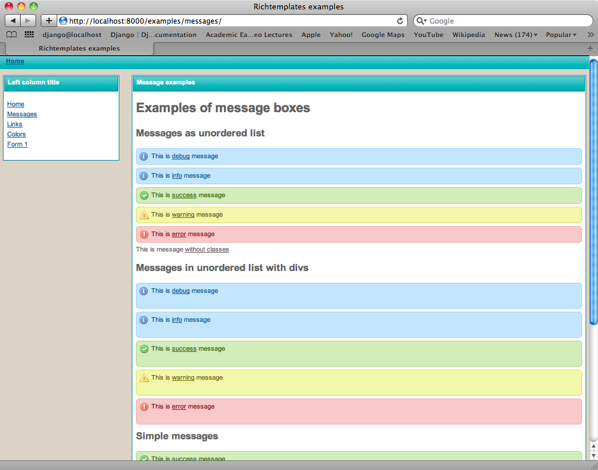

.. _screenshots:

===========
Screenshots
===========

Here you can find some screenshots from projects using `django-richtemplates`.

Examples
--------

Those screenshots comes from build in ``example`` application.

Home page
~~~~~~~~~

Messages
~~~~~~~~

django-projector
----------------

Screenshots below comes from project ``django-projector`` which uses
``django-richtemplates``.

Login page
~~~~~~~~~~

Project list
~~~~~~~~~~~~

Project details
~~~~~~~~~~~~~~~

Task update
~~~~~~~~~~~

Task after update
~~~~~~~~~~~~~~~~~

