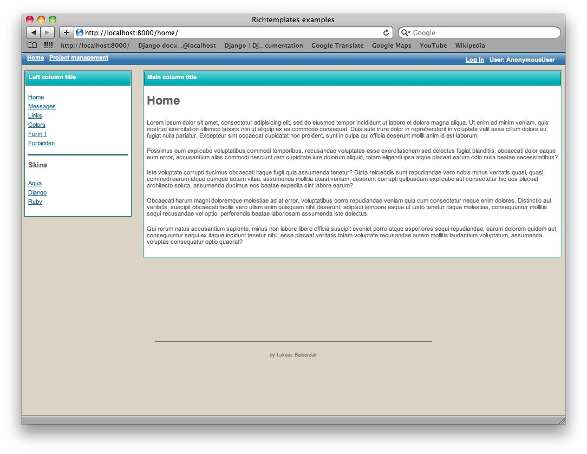
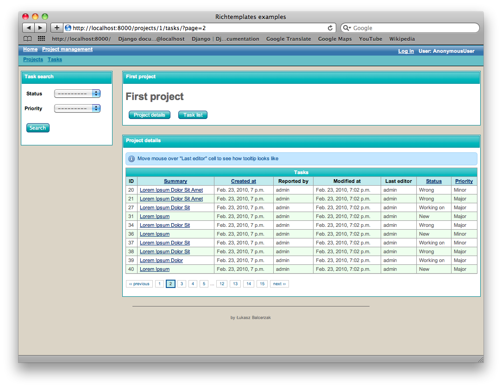
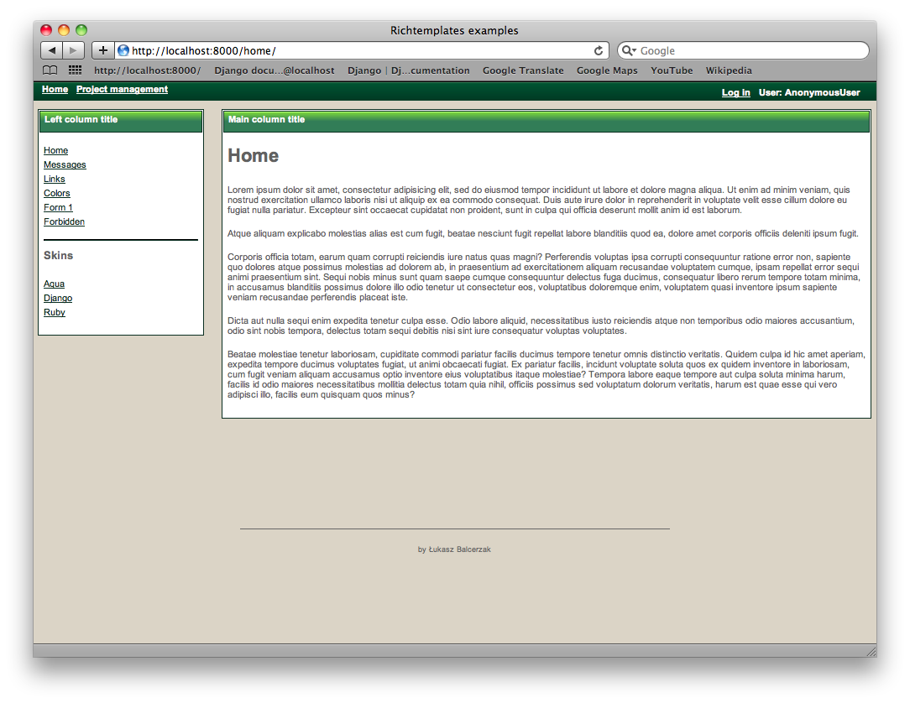
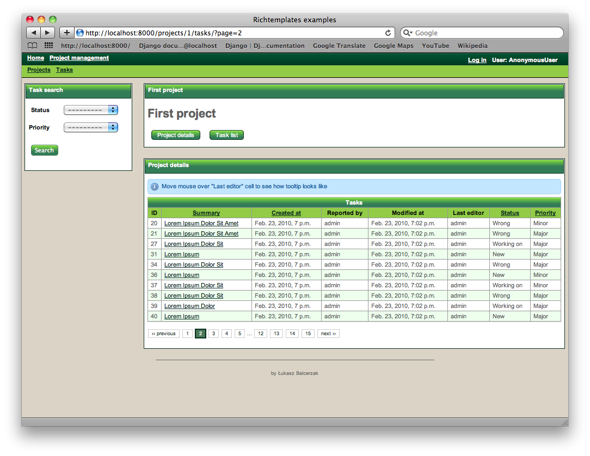
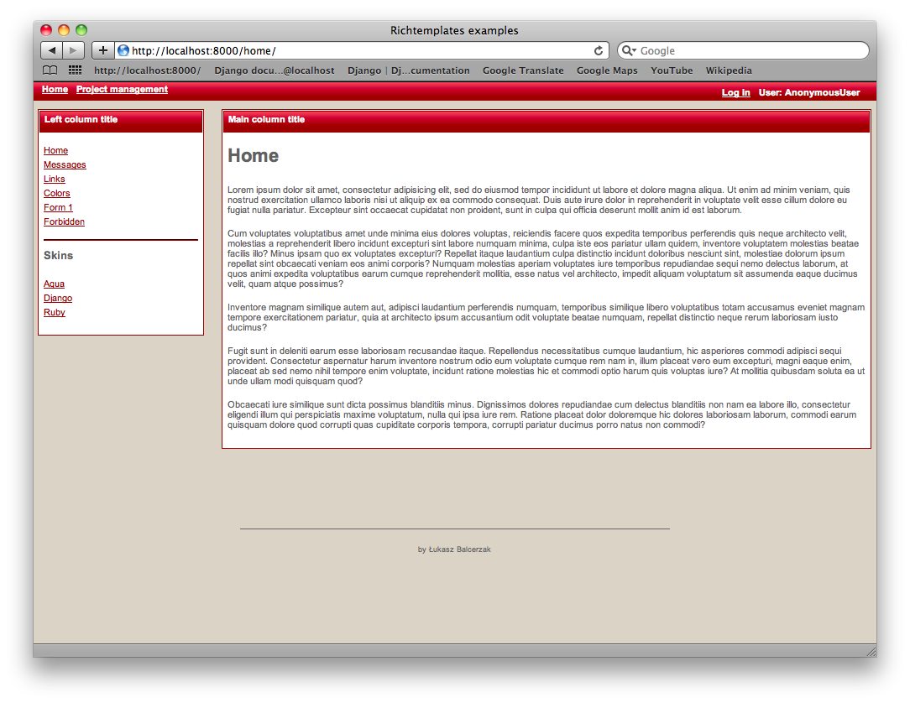
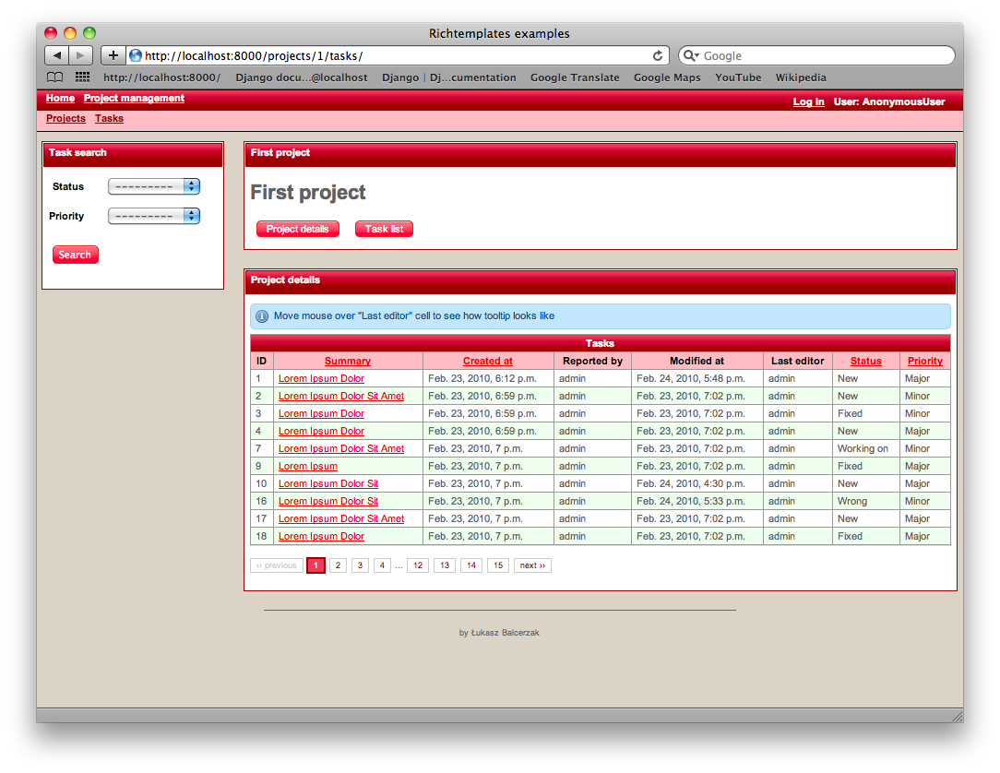

.. _skins:

Skins
=====

Skins are set of color schemes standing on top of templates.
``django-richtemplates`` comes with following skins:

1. `Aqua skin`_ (alias: *aqua*, default skin) - light blue colors
2. `Django skin`_ - (alias: *django*) `Django`_ colors skin (deep green)
3. `Ruby skin`_ - (alias: *ruby*) deep red colors

Default skin
------------

Default skin for ``django-richtemplates`` is `Aqua skin`_. You may override
this by providing ``RICHTEMPLATES_DEFAULT_SKIN`` in your settings module. For
example, if you would like to use `Django skin`_ as default ``richtemplates``
skin in your project you need to put following line in your settings module:

.. code-block:: python

   RICHTEMPLATES_DEFAULT_SKIN = 'django'

Writing a skin
--------------

Writing a skin is simple as skin is only one small css file. Take a look at
the boundled skins, they are located at ``richtemplates/media/css/skins/``.
Make a copy of the chosen skin and change it as you like.

After you make your own skin you would need to hook it
into ``django-richtemplates``. Follow `Adding new skin`_ instructions.

Adding new skin
---------------

Already created a new css file? Great, but you still need to hook it into your
project. To do so, you have to provide information on your skin at settings
module in ``RICHTEMPLATES_SKINS`` dictionary. Being more precise, you have to
define skin's name and url to newly defined skin.  Skins are recognized by
alias which should be a key of the dictionary.

.. note::
   Alias of the skin should be a *slug*. At runtime, ``richtemplates``
   would check if the alias is a proper *slug* using
   ``django.template.defaultfilters.slugify`` function.

Here is an example:

.. code-block:: python

   RICHTEMPLATES_SKINS = {
       'myskin': {'name': 'My custom skin name', 'url': 'mycss/myskin.css'},
   }

Note that we haven't define full url - ``richtemplates`` would put ``{{
MEDIA_URL }}`` in front of it. Moreover, if you would put ``myskin.css`` at
``{{ MEDIA_URL }}/richtemplates/css/skins/`` location you would not need to
define ``url`` at all, and you could simply write:

.. code-block:: python

   RICHTEMPLATES_SKINS = {
       'myskin': {'name': 'My custom skin name'},
   }

.. note::
   You need to define ``url`` in ``RICHTEMPLATES_SKINS`` only if name of the
   css file is the same as alias of the skin (key of ``RICHTEMPLATES_SKINS``
   dictionary.

Aqua skin
---------

This is light blue (quite popular for last few years) skin. It is default skin.
Here are two shots:

Django skin
-----------

Skin inspired by `Django`_ webpage. Here are two shots:

Ruby skin
---------

Deep red colors skin. Here are two shots:

.. _django: http://www.djangoproject.com

